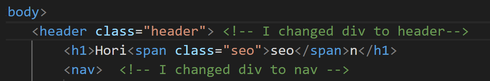
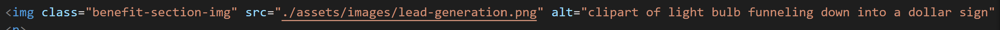
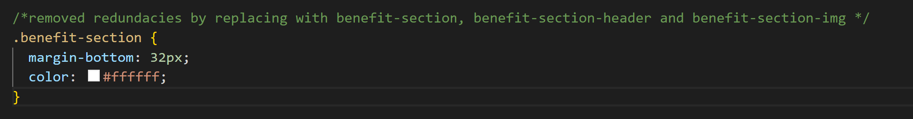

# Horiseon-Accessibility-Upgrades
## Description
We have made the following revisions to the Horiseon homepage:
1.  Revised Div elements to Semantic elements; See example here: 
2.  Added accessibility descriptors to all photos; See example here: 
3.  Made a more descriptive title; See here: 
4.  Removed redundant code and extraneous elements/descriptors from the CSS file; See example here: 
## Link
https://aaloksikand.github.io/Horiseon-Accessibility-Upgrades/